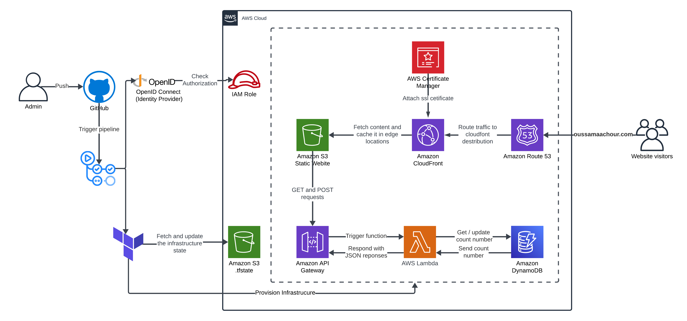

# aws-s3-static-website

## Project Objective:
The primary objective of this project is to gain a solid understanding of Amazon Web Services (AWS) and DevOps principles, particularly focusing on Continuous Integration/Continuous Deployment (CI/CD) and Infrastructure-as-Code (IaC).

The project culminates in a hosted personal website on AWS, showcasing an automated workflow for updating both website content and infrastructure using Terraform and GitHub Actions.

Feel free to explore my website and let's connect! :grin: 

Website : [oussamaachour.com](https://oussamaachour.com)

Here you find the architecture diagram of the project:

<!-- ## Content : 
1. # Technologies
*  How to install and run the project
*  Folder structure explanation and challenges
*  Known issues and credits
*  future improvements
*  License and versioning -->

## Technologies :

### Website : 
For building this website, i made use of the [BootstrapMade Laura](https://bootstrapmade.com/laura-free-creative-bootstrap-theme/) template as a foundation , with  some customizations in the source code .\
**Technologies :** HTML , CSS , JavaScript

### Amazon Web Services :
For hosting the website, we opted for [Amazon Web Services](https://aws.amazon.com/) as a cloud provider. \
All infrastructure resources are provisioned and managed within the AWS environment.

### Terraform : 
As an Infrastructure-as-Code tool , we made use of [Terraform](https://www.terraform.io/) for defining managing the project's infrastructure resources

### GitHub Actions: 
As a CI/CDtool, we made use of the github built-in tool [GitHub Actions](https://github.com/features/actions), for consciously deploying the website and building the infrastructure.

## AWS Architecture Overview:
This document provides an overview of the architecture and the role of each component in our AWS-based solution.
### Amazon S3:

Here we provisioned two Amazon S3 buckets : 

- **Static Website Hosting:** One bucket is used to store and serve the HTML static pages of the website. This enables easy access to the frontend content.
- **Terraform State Storage:** Another S3 bucket is dedicated to storing Terraform state files, facilitating state management for infrastructure provisioning.
### Amazon CloudFront: 

- Amazon S3 website endpoints do not support HTTPS. 
If you want to use HTTPS, you can use Amazon CloudFront to serve a static website hosted on Amazon S3

* Content delivery : levering edge points to guarantee the lowest latency 
### Amazon Route 53: 
Rout53 was used for two main purposes : 
- **Domain Registration:** by acquiring a customer domain name *"oussamaachour.com"* . 
- **Traffic Routing:** directing incoming traffic from end-users to the CloudFront distribution

### AWS Certificate Manager (ACM): 
To secure traffic (HTTPS) between clients and CloudFront, we created an ACM certificate. This SSL certificate is then attached to the CloudFront distribution, enabling secure communication.

### AWS Lambda:
A Lambda function is responsible for updating and retrieving the website visits counter in DynamoDB. It reads from and writes to the DynamoDB table as needed.

### Amazon DynamoDB:
We utilized DynamoDB to manage a website visits counter. A Lambda function is triggered each time a visitor accesses the website, updating the counter in DynamoDB.

### Amazon API Gateway:
An HTTP API is created using Amazon API Gateway to allow communication between the frontend website and the backend Lambda function. This API exposes the Lambda function as HTTP endpoints for client interaction.
### IAM Role (For Open ID Connect OIDC): 
GitHub Actions, being an external entity, requires proper authorization to interact with AWS resources. To achieve this, we created an IAM role granting necessary permissions to GitHub Actions for deploying AWS resources securely.

Note: Each GitHub Actions workflow has its own IAM role with restricted permissions (following the least-privilege principle) tailored to the specific actions and resources involved in the workflow. This ensures a secure and controlled deployment process.

## Continuous Integration / Continuous Deployment: GitHub Actions 
We have defined three workflows in separate YAML files:

- **website.yaml:**  Automates website deployment triggered by changes in the website source code directory.
- **frontend.yaml:** Automates frontend-related resources (Amazon S3 Bucket, CloudFront, Route53, Amazon ACM Certificate) triggered by changes in the frontend Terraform script.
- **backend.yaml:** Automates backend-related resources (AWS Lambda, DynamoDB, Amazon API Gateway) triggered by changes in the backend Terraform script.

## Infrastructure-as-Code:Terraform
Within both the frontend and backend repositories, we have structured a Terraform folder containing the main.tf file defining respective resources, alongside vars.tf and provider.tf files.

## Future improvements: 
As part of ongoing enhancements to the project, we are planning to implement the following improvements:

- Integrating Issue Validation: Such feature will allow administrators to validate proposed changes before they are implemented.